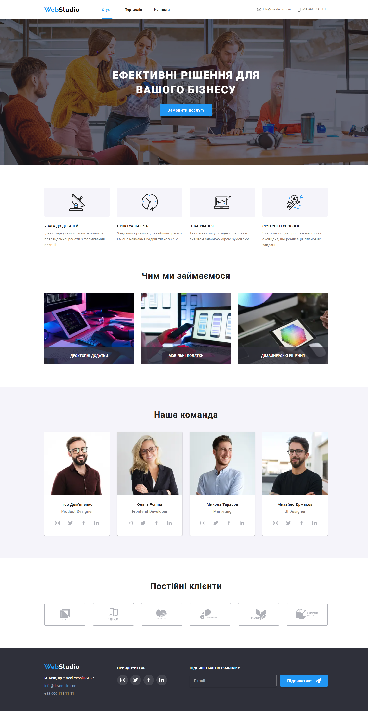
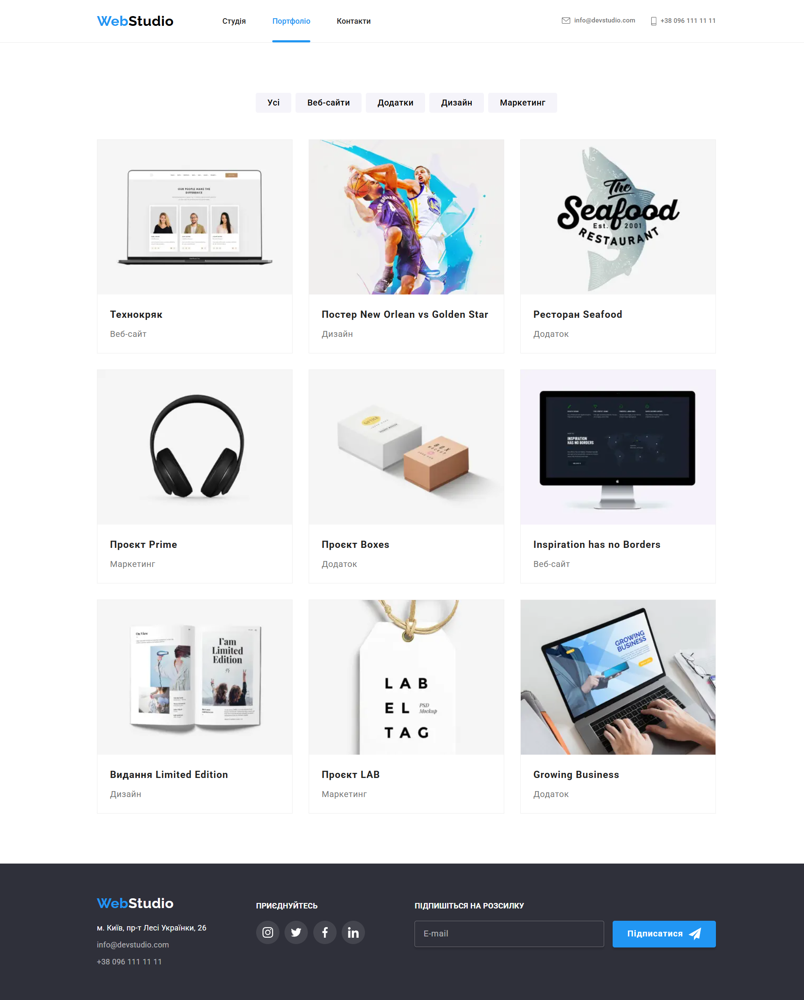

# 🚀 GoIT Markup Homework

## 📌 Project Description
This project is a responsive web page built as part of the GoIT Front-End course. The page follows modern HTML & CSS best practices and showcases fundamental web development skills.

🔗 **Live Demo:** [GitHub Pages](https://yuliiakulish.github.io/goit-markup-hw/)

---

## 🛠 Technologies Used
- **HTML5** – semantic and accessible markup
- **CSS3** – modern styling techniques, including Flexbox and Grid
- **Responsive Design** – mobile-first approach for different screen sizes
- **Git & GitHub** – version control and project hosting

---

## 📥 How to Run Locally
1. Clone the repository:
   ```bash
   git clone https://github.com/YuliiaKulish/goit-markup-hw.git
   ```
2. Open the project folder:
   ```bash
   cd goit-markup-hw
   ```
3. Open `index.html` in your browser.

---

## 🖼️ Preview


---

## ✨ Features
✅ Fully responsive layout<br>
✅ Clean and maintainable code<br>
✅ Modern CSS techniques<br>
✅ Hosted on GitHub Pages

--

## 🇺🇦 Опис українською
Цей проект – адаптивна веб-сторінка, створена в рамках курсу GoIT. Використано сучасні технології HTML і CSS для побудови якісного макету.

🔗 **Демо:** [GitHub Pages](https://yuliiakulish.github.io/goit-markup-hw/)